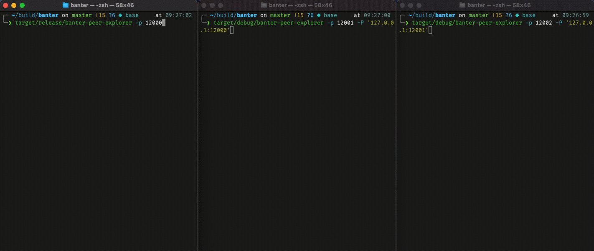

# Banter - Peer-to-peer CLI chat

This is a simple CLI chat client, running via a p2p network.

## Showing off

First, let's take a look at normal operation of a banter network:

### The network propagates messages

Actually, each node is restricted to know 128 peers (currently hardcoded). The
app would still be usabe beyond that, as verified when disabling syncing of the
peerlist:

### Peer explorer

The following gif shows how peers are propagated in normal mode, as well as the
`banter-peer-explorer` binary, whose purpose is plain testing of the p2p layer:

## Commands

Commands begin with a colon `:`. Anything that is typed and doesn't start with a
colon will be interpreted as a message and broadcasted to the network, which
will propagate it as shown above.

| Command       | What it does                           |
| ------------- | -------------------------------------- |
| `:l`, `:list` | Prints a list of currently known peers |
| `:q`, `:quit` | Exits the chat app                     |

## Why didn't I use libp2p?

Because the whole idea of this project was to learn some more about p2p
networking.
